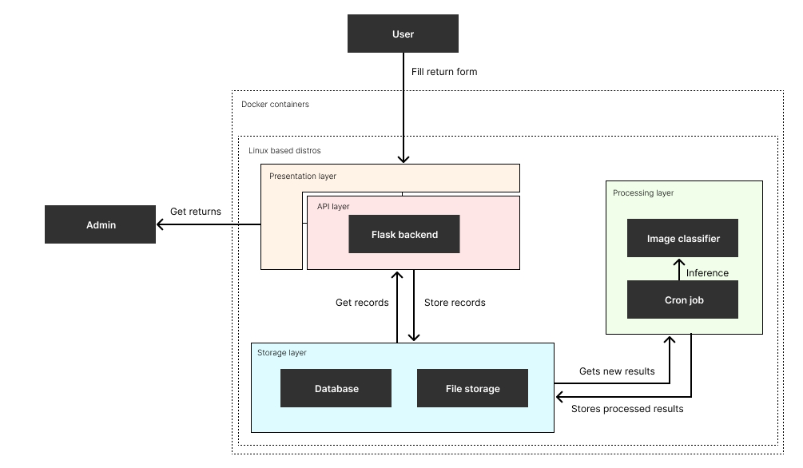

# AI Refund System

An end-to-end machine-learning prototype system for automating product-return classification. Customers
submit a photo of a returned item through a web interface; a fine-tuned CNN classifies
the item, and a scheduled worker validates each prediction and routes it either to
automatic processing or to human review.

## Architecture

The system runs as two containerized services that share a SQLite database and an
image store:

- **web** (`docker/Dockerfile.web`) — a Flask application that accepts return
  submissions and serves a dashboard. New submissions are stored with status `New`.
- **worker** (`docker/Dockerfile.worker`) — a batch classifier that runs on a cron
  schedule, loads the trained model, and processes all pending returns.



## Features

### Model
- **Transfer learning** — a pretrained **ResNet152** is fine-tuned to classify items
  into 10 clothing categories (Dress, Hat, Longsleeve, Outwear, Pants, Shirt, Shoes,
  Shorts, Skirt, T-Shirt).
- **Training pipeline** (`src/train.py`):
  - Seeded 70/15/15 train/validation/test split
  - **Class-imbalance handling** with a `WeightedRandomSampler` (inverse-frequency weights)
  - Adam with weight decay, **early stopping**, and **checkpoint save/resume**

### Web service
- **Two-tier design** — a frontend route forwards uploads to an internal API endpoint
  that decodes the image, stores it, and writes the return record to the database.
- **Dashboard** for reviewing stored returns and their predicted categories and statuses.

### Scheduled worker (batch classification)
- Runs `src/jobs.py` on a cron schedule inside the worker container.
- Fetches all returns with status `New`, loads the trained classifier
  (`models/best_model.pth`), and runs inference in **batches of 32** (GPU-accelerated
  when available).
- **Confidence- and consistency-based routing** (human-in-the-loop):
  - **Flagged** — prediction confidence below 0.7, *or* the predicted category does not
    match the category the customer submitted → sent for human review.
  - **Processed** — confident prediction that agrees with the submitted category.
- Writes the predicted category, confidence score, and updated status back to the database.

## Tech stack

- Python, PyTorch / torchvision (ResNet152)
- Flask
- SQLite
- Pillow
- Docker (two services: web + cron worker)

## Data model

A normalized SQLite schema, initialized and seeded by `src/db.py`:

- **categories** — the 10 clothing categories.
- **statuses** — `New`, `Processed`, `Flagged`.
- **returns** — return records: `order_id`, submitted `category_id`,
  `status_id`, `predicted_category_id`, `confidence`, and `image_path`, with foreign
  keys to `categories` and `statuses`.

## Getting started

### Local

```bash
pip install -r requirements.txt

# Initialize the database (creates tables + seed data)
python src/db.py

# Run the web app
python src/app.py
```

Open `http://127.0.0.1:5000/upload` to submit a return, or `/dashboard` to view stored
returns.

### Docker

```bash
# Web API
docker build -f docker/Dockerfile.web -t ai-refund-web .
docker run -d -p 5000:5000 -v "$(pwd)/data:/src/data" ai-refund-web

# Worker (scheduled batch classifier)
docker build -f docker/Dockerfile.worker -t ai-refund-worker .
docker run -d -v "$(pwd)/data:/src/data" ai-refund-worker
```

Both containers share the database and image folder through the mounted volume. The
worker's schedule is defined in `docker/Dockerfile.worker` (`/etc/cron.d/jobs`).

## Training

Place the dataset under `data/` (images plus a metadata CSV with a `label` column),
then run the training script. The best-performing checkpoint is saved to
`models/best_model.pth` and final test accuracy is reported.

## Project structure

```
src/app.py     # Flask web + internal API + dashboard
src/model.py   # ResNet152-based ImageClassifier
src/train.py   # Training loop (weighted sampler, early stopping, checkpointing)
src/jobs.py    # Scheduled batch classifier + confidence-based routing
src/db.py      # SQLite schema initialization + seed data
docker/        # Dockerfile.web and Dockerfile.worker
```

> Note: A portfolio project demonstrating an end-to-end ML workflow — train, serve,
> schedule, and route with a human-in-the-loop review step.
